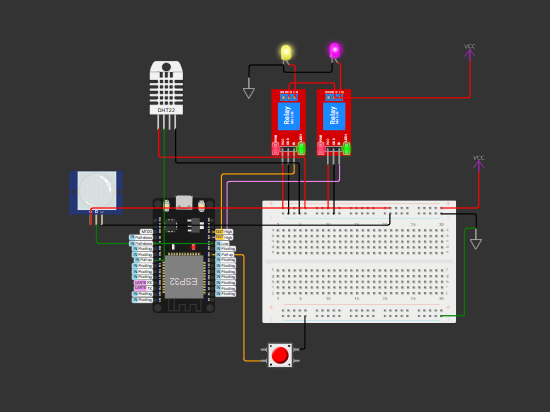

# SmartHome_IOT_Project
# Smart Home Automation System with ESP32 and Blynk

## Overview

This project presents a Smart Home Automation System utilizing an ESP32 microcontroller integrated with the Blynk platform. The system enables remote monitoring and control of environmental parameters and appliances, enhancing convenience and energy efficiency.

## Features

- **Remote Monitoring:** Real-time tracking of temperature, humidity, and motion detection through the Blynk app.
- **Appliance Control:** Manage two appliances remotely via Blynk or manually using physical controls.
- **Motion-Activated Automation:** Automatically control appliances based on motion detection.
- **Manual Override:** Physical pushbutton allows manual control of appliances, ensuring functionality without internet connectivity.

## Components

- **ESP32 Microcontroller:** Central unit managing sensor data and communication with Blynk.
- **DHT22 Sensor:** Measures ambient temperature and humidity.
- **PIR Motion Sensor:** Detects motion for automation based on occupancy.
- **Relays:** Two relays control connected appliances.
- **Pushbutton:** Allows manual toggling of the first relay.

## Circuit Diagram



*Note: Ensure all connections are secure and correct to prevent damage.*

## Blynk Setup

1. **Install Blynk App:** Download from the [App Store](https://apps.apple.com) or [Google Play Store](https://play.google.com/store).
2. **Create New Project:** Name it (e.g., "Smart Home"), select "ESP32" as the device, and note the provided Auth Token.
3. **Add Widgets:**
   - **Gauge Widgets:** For temperature (V5) and humidity (V6).
   - **LED Widget:** For motion status (V3).
   - **Button Widgets:** To control Relay 1 (V1) and Relay 2 (V2).

## Code Description

The code initializes the ESP32, connects to Wi-Fi and Blynk, and sets up sensors and relays. It includes:

- **Blynk Write Functions:** Handle virtual pin state changes to control relays.
- **Sensor Monitoring:** Periodically reads temperature, humidity, and motion status, sending updates to Blynk.
- **Manual Control:** Monitors the pushbutton to toggle Relay 1 and updates Blynk accordingly.

## Getting Started

1. **Clone Repository:**
   ```bash
   git clone https://github.com/your-username/smart-home-automation.git
